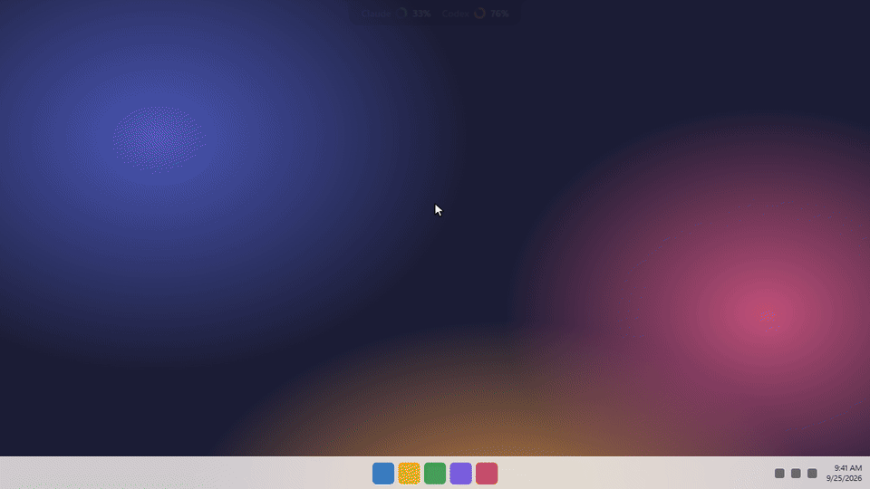
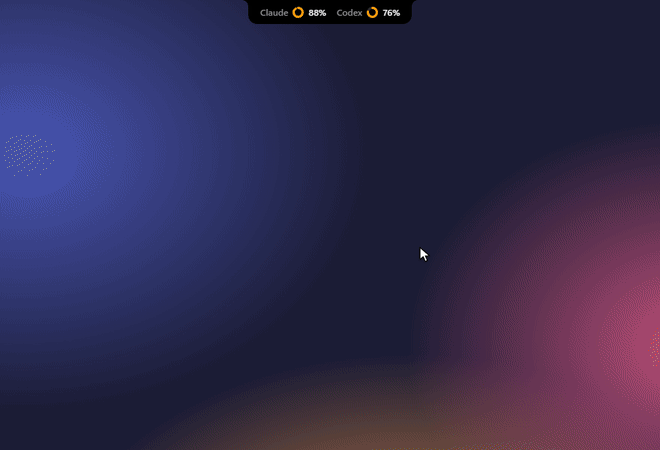

<div align="center">


# Usage Bar

Your Claude Code and Codex plan limits, in a Dynamic Island at the top of your screen.



</div>

## Features

- **No sign-in**: reads the credentials Claude Code and Codex already saved.
- **Windows + WSL**: finds accounts in your Windows profile and in every WSL distro.
- **At a glance**: session and weekly limits, reset times, credits.
- **Multiple accounts**: add as many Claude and Codex accounts as you like and switch with one click, or let it switch for you when one hits its limit.
- **Goes where you want it**: drag it to the top, a side or the taskbar, on any monitor, or keep it as a tray icon.
- **Stays out of the way**: hover to expand; clicks outside the island pass through.
- **Speaks your language**: follows the system language (10 languages, English fallback).

## Multiple accounts

<p align="center"></p>

Add accounts in **Settings → Accounts**: Usage Bar opens the CLI's own sign-in (`claude auth login` / `codex login`) in an isolated folder, so your current login is untouched. Switching rewrites the CLI's login files in place; the official CLI keeps doing all the work. Turn on **Switch automatically** to move to the account with the most headroom when the active one reaches your threshold.

> [!NOTE]
> A running Codex session keeps its account until you restart it.

## Build

Cross-compiled for Windows from WSL/Linux:

```bash
rustup target add x86_64-pc-windows-msvc
cargo install --locked cargo-xwin
sudo apt install -y nsis lld llvm clang
pnpm install
pnpm tauri build --runner cargo-xwin --target x86_64-pc-windows-msvc --no-bundle
```

The app is at `src-tauri/target/x86_64-pc-windows-msvc/release/usage-bar.exe`.

> [!NOTE]
> Usage Bar never refreshes tokens, so it can't log you out of your CLI. If a token expires, open `claude` or `codex` once.

## Releases

Every push to `main` builds on GitHub Actions and publishes a release (`v0.1.<run>`) with the installer, the MSI and the standalone `.exe`.

## License

[GPL-3.0](LICENSE). Use it, change it, share it; derivative works must stay open source under the same license.
